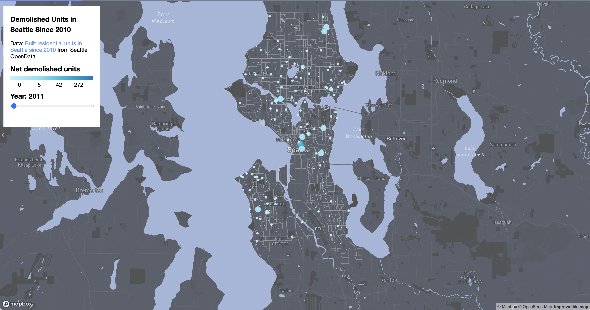
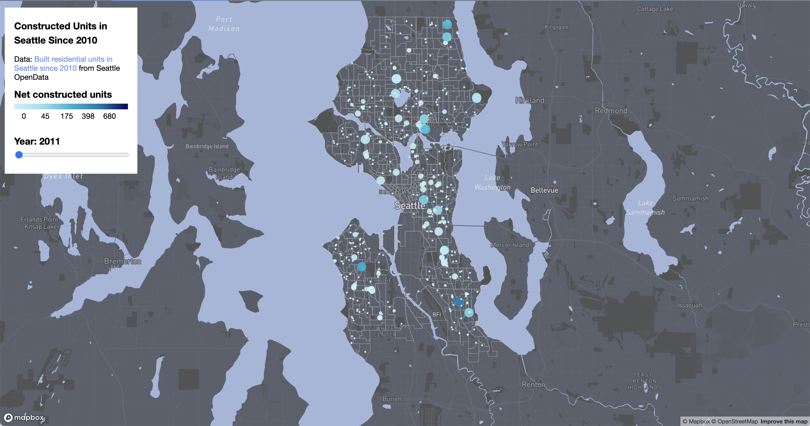

# Gentrification in Seattle
Link to project: [https://aileenkuang.github.io/geog328-seattle-gentrification/index.html](https://aileenkuang.github.io/geog328-seattle-gentrification/index.html)

## Project Goals and Description

Gentrification is the process of neighborhood change resulting from young and/or affluent people moving into areas that have historically been home to marginalized communities (Fogel). Because of this, community members are often forced to move, which leads to a loss of community, history, and culture (Fogel). While this phenomenon has been occurring across the United States, it is especially relevant in Seattle because it is the third most quickly gentrifying city in the nation (Fogel). In fact, Seattle’s Chinatown-International District – a neighborhood home to a vibrant AAPI community – was recognized as one of the eleven most endangered historic places in the country this year (Clarridge). 

In this project, I examine the process of gentrification in Seattle using residential construction and demolition permit data. Specifically, this project seeks to answer the following questions: **How has Seattle gentrified over the past decade (2011-2023)? What areas of Seattle have been the most affected by gentrification?** This project aims to provide Seattle policymakers, activists, non-profits, and interested community members with information about gentrification occurring city-wide to support decision-making and advocacy.

## Data Sources and Cleaning

This project utilizes the [Built Units Since 2010 dataset](https://data-seattlecitygis.opendata.arcgis.com/datasets/SeattleCityGIS::built-units-since-2010/explore) from Seattle GeoData, which contains residential construction and demolition permits issued by the City of Seattle from 2010 (not-inclusive) to the current year (2023). This data set only includes completed permits; also each record lists the number of residential units constructed or demolished for each housing type in the project. It is possible for an individual building permit to appear multiple times, and for there to be multiple permits recorded for a single address. The housing unit types in this data set are static, meaning that they reflect the unit types that existed at the time that the permit was issued. 

I took multiple steps to clean this data in JavaScript. First, to remove clutter and decrease the file size of the data set, I removed feature properties that did not appear immediately relevant to my project (permit numbers, urban village information, zoning information, inspection dates, etc.). Then, I began the process of removing duplicate entries – if there were multiple permits for one address with the same permit type, I deleted all but one entry for that address. Finally, to ensure that the data set could be used with the Mapbox template I was interested in, I converted the YEAR_FINAL column (recording the year that the permit was finalized) from a string to integer type. 

For this project, I created a custom base map with [2020 block groups](https://data-seattlecitygis.opendata.arcgis.com/datasets/2020-census-block-groups-seattle-1/explore) in Seattle. The data for the block group boundaries was also accessed through Seattle GeoData. I did not take any additional steps to clean this data. 

## Applied Base Maps and Libraries

This project utilizes the Mapbox GL JS API; it is built on the [“Show changes over time” template](https://docs.mapbox.com/help/tutorials/show-changes-over-time/) provided by Mapbox. This project also utilizes Github and MapBox Studio. Github was used for version control and loading the maps onto the web, and MapBox Studio was used for the development of the basemaps. In creating a basemap, I added 2020 Seattle block-group boundaries to Mapbox’s pre-existing Monochrome base map template. 

## Project Development, Functions, & Findings

This project contains two maps: one displaying net demolished units in Seattle from 2011 to 2023 (Fig. 1), and one displaying net constructed units in Seattle from 2011 to 2023 (Fig. 2). There are two main interactive functions on this webpage; the user is able to toggle between the demolished and constructed units maps, and the user is able to utilize the slider in the console (located at the top left of the map) to display data for the year of their choice. Furthermore, the console contains a direct link to the data set used in the map as well as a map legend (which differs between the two maps).

Figure 1: Screenshot of demolished units map with the year slider positioned at 2011.

Fig. 2: Screenshot of constructed units map with the year slider positioned at 2011.

These maps show that the number of demolished and constructed units in Seattle generally increased over time. Notably, there was a spike in demolitions during 2016 and 2017; after this, the demolitions decreased. Construction has a much more stable pattern than demolition, with the number of construction permits continually increasing over the past decade. Using construction and demolition as markers of gentrification, then, we confirm that Seattle has gentrified in the past decade.

It is also important to pay attention to the spatial distribution of construction and demolition in the city. Both maps consistently show that development occurs the most in the center of the city (in the Downtown and Central District areas). This holds significance for community members, advocates, and policy makers who are invested in the issue of gentrification. While this project does not include demographic data, it may be useful for stakeholders to cross-reference these maps with Seattle’s racial and income distribution to identify at-risk communities.

## Limitations

Of course, there are limitations to this visualization. First, the data set used only includes residential permits, which means that commercial development is not shown in this project. Moreover, due to the constraints of the map template and lack of available data, this project does not include demographic data layers. This does not invalidate the project findings; however, because gentrification is necessarily tied to race and class, this webpage is missing information that could be useful to stakeholders. Lastly, I would like to acknowledge that the findings of this project may not be completely expected. Seattle’s Chinatown has been at the center of many discussions about gentrification in the city recently, but these maps show a concentration of development occurring in the center of Seattle. This does not suggest that gentrification is not occurring in Chinatown, but that a different approach to examining the available data is useful – for example, we may want to specifically zoom in on the block groups in Chinatown and see how they have changed over time. The limitations I have identified in this section are areas that can be addressed in the continued development of this project.

## Acknowledgements

I would like to thank Dr. Bo Zhao for his guidance and support throughout this project. I would also like to acknowledge prior projects by the [Seattle Civil Rights and Labor History Project](https://depts.washington.edu/civilr/maps_race_seattle.htm), [Nil Tuzcu](https://www.niltuzcu.net/chinatown-mapping), and [Allen Yu, Juan Moreno, and Christiansen Mayo](https://storymaps.arcgis.com/stories/2f0792826dc14e0b99d04fc4c0142a3c) which provided inspiration for this project.

## References

Clarridge, Christine. Seattle’s Chinatown among most endangered historic places. Axios, 2023, https://www.axios.com/local/seattle/2023/05/10/seattle-chinatown-historic-endangered-place. 

Fogel, Rebecca. Gentrification and changing foodscapes in Seattle. Urban@UW, 2020, https://urban.uw.edu/news/gentrification-and-changing-foodscapes-in-seattle/. 